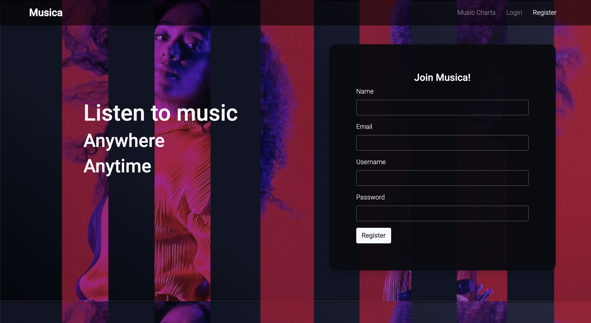
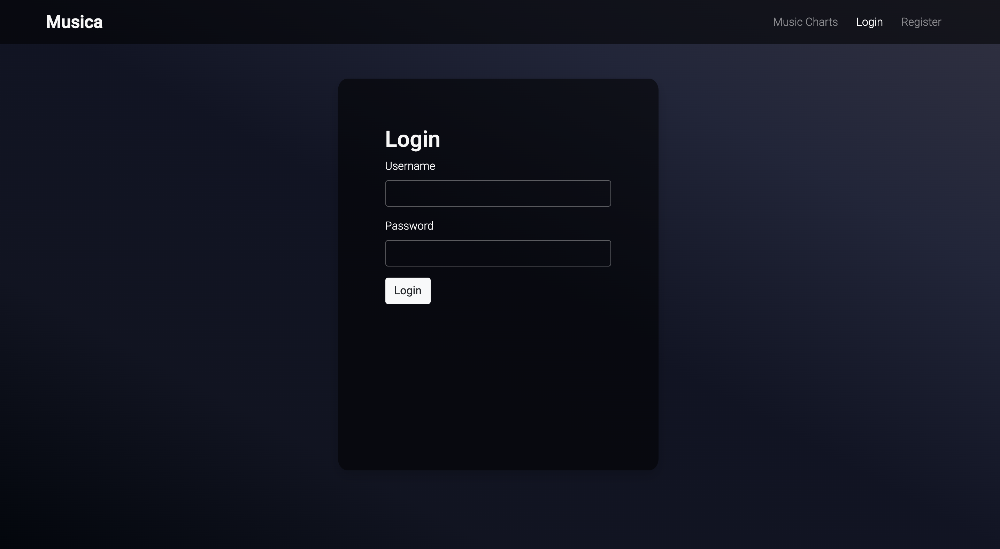
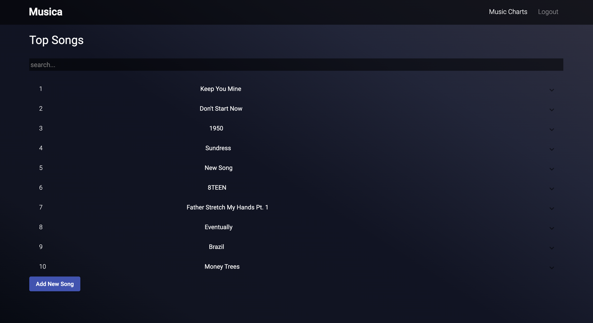
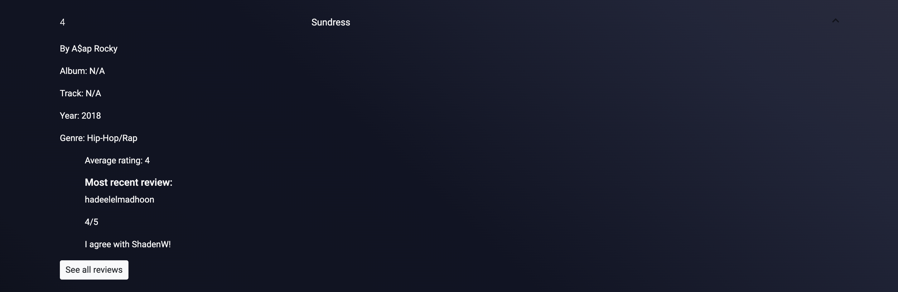
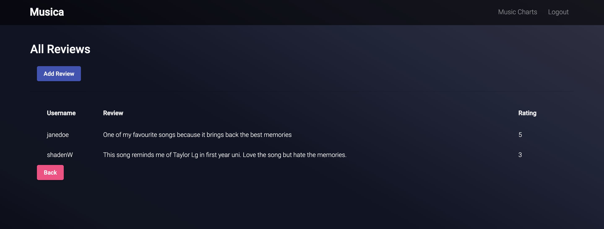
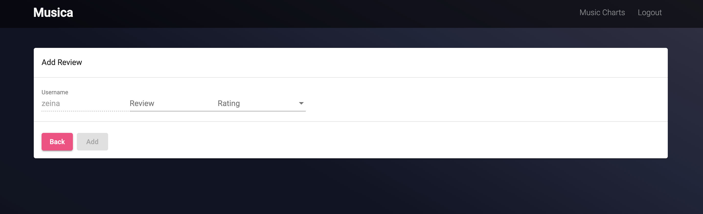

# Musica

## How to run

1. Clone the repository
2. In one terminal, navigate to Musica/backend and run the command: node server.js
3. In another terminal, navigate to Musica/frontend and run the command: ng serve
4. Go to the link http://localhost:4200/

## Preview
Musica Registration Page

Musica Login Page

Musica Music Charts

Musica Song Info

Musica Song Review

Musica Add Song Review

